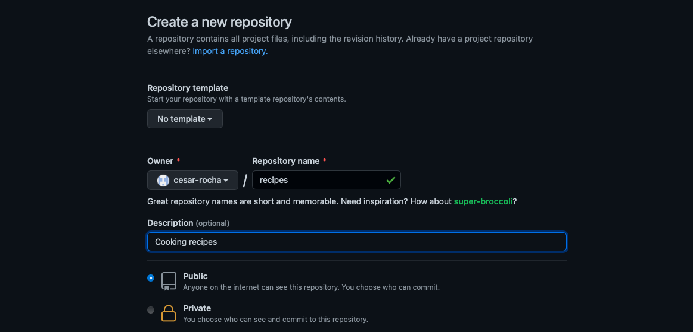

# Lecture 3: Version control with git and Github


This optional [video](https://www.youtube.com/watch?v=21Gl97tkbHU) explains what is git and Github and how to get started.

## git

Git is a command-line software that tracks changes in code. Git is now widely used for software development from simple analysis code to complex climate models. When coupled with an online repository service, such as Github, git is a powerful tool for working collaboratively on coding projects. For example, numerical models such as [MOM6](https://github.com/NOAA-GFDL/MOM6) and [MITgcm](https://github.com/MITgcm/MITgcm) are developed collaboratively on Github, with git as the version control software.


Let's first set up git:

    git config --global user.name "First and Last Name"
    git config --global email "Email"

You should use the email linked to your Github account.

To begin working with git, let's create directory for this lecture:

    cd MARN5895/Lectures/
    mkdir 03
    cd 03/

### Initializing git repository

Now ... We will create a directory called planets, where we will add some text files:

    mkdir recipes
    cd recipes

To start using git in a directory, you need to initialize the repository:

    git init

This generates configuration files stored in a hidden `.git` directory:

    ls -a
    ls .git

### Tracking new files
Let's create a new file:

    nano frosting.txt

You add some text:

```BASH
Ingredients:
 - 1/2 cup butter
 - 2/3 cup cocoa
 - 3 cups powdered sugar
 - 1/3 cup milk
 - 1 teaspoon vanilla extract
```

If we do `git status`, we see that `frosting.txt` appears as an untracked file. We need to add it to the tracking system using `git add`:

    git add frosting.txt

Now `git status` returns...


Let's add some text with directions:

```BASH
Directions:
  1. In a medium saucepan, melt butter and stir in cocoa.
  2. Alternately add powdered sugar and milk. Beat until light and fluffy.
  3. Stir in vanilla.  If necessary, add a small amount of additional milk.
```

We should now add and commit these changes:

    git add frosting.txt
    git commit -m "Add directions"

We can check the history of `frosting.txt` using `git log`:

    git log frosting.txt

Tracking the HEAD (the most recent version):

    git checkout HEAD frosting.txt

Now let's checkout the commit log:

    git log frosting.txt


---
EXERCISE: Create a file for a recipe of your choice. 

1. Use the Web to find a recipe of a meal you like.
2. Create a file with the necessary ingredients and start tracking it with git.
3. Add instructions for the recipe, then commit the changes.
4. Verify you successfully tracked the file changes with `git log`.

---

## Github
Github is an internet service for software development with git. It allows users to have remote repositories linked to local repositores, providing a cloud-based platform for storing and tracking changes to code.


To begin working with Github, let's visit github.com and create a new repository:



    git remove -v 

    git remote add origin https://github.com/cesar-rocha/recipes

**You chould change the path above to the path of your repository, which involves your Github username.**

<!-- 
### Raising issues

### Pull requests (PRs) -->

## Key points 

- `git` is a powerful version control used to track changes in code.

- `Github` is an internet service used for collaboration and software development.

- `Github` is also a great tool for backing up, documenting, sharing code.