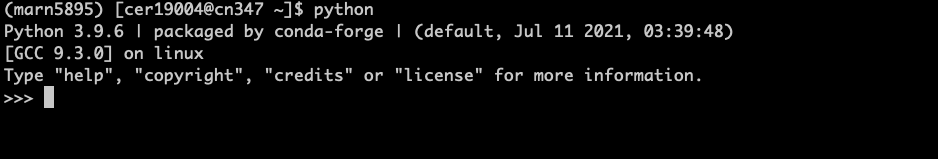
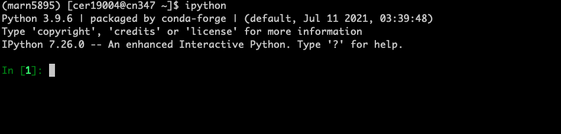
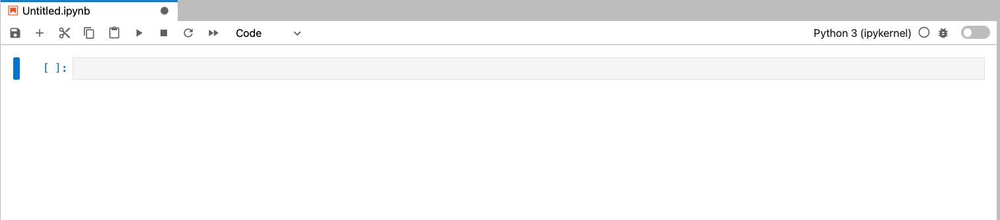

# Lecture 4: Python basics


## Why Python?

Python was developed by a computer scientist and is a general-purpose language. It has a simple syntax
and runs efficiently.

[Eric Firing](https://github.com/efiring), a geeky oceanographer who contributed code to many widely used scientific Python packages, lists 
a number of reasons to use Python instead of Matlab:

1. Python is fundamentally a better computer language in many ways.

    * It is suitable for a wider variety of tasks.
    * It scales better from the shortest of scripts to large software projects.
    * It facilitates writing clearer and more concise code.
    * With associated tools, it makes for easier access to existing high-performance codes in compiled languages, and for using smaller pieces of compiled code to speed up     critical sections.

2. Because Python is Free and Open Source Software (FOSS), you can install it on any machine without having to deal with a license manager.

3. For the same reason, Python code that is part of a research project can be run by anyone, anywhere, to verify or extend the results.

4. Most Python packages you are likely to want to use are developed in an open environment. The scientific Python ecosystem is dynamic and friendly.

Cesar began using Python when he started his Ph.D. in 2013. For data analysis, he used to code in Matlab. He was passionate about open science and wanted people 
everywhere to be able to verify his research results and build on his work (Firing's reason 3). It wasn't an easy transtion back then, because his advisor and most of his friends and colleagues in graduate school used Matlab, whose most primitive version was developed by geophysicists at IGPP/Scipps.  He got through it with the help 
of then-postdoc [Jinbo Wang](https://science.jpl.nasa.gov/people/jwang2/) and the wonderful online Python community. Today, Python is probably the programming language most widely used in Data Science applications. In the 2-minute segment of video starting [here](https://youtu.be/gJd-Ohf1FfM?t=1145), physical oceanographer James Munroe explains why Python is probably the most effective programming language for scientific applications. The full video is recommended if you wish to have an overview about "Big Data Oceanography".  There exist many high-quality Python packages for Earth and Marine Sciences mainted by a community of developers in the US and elsewhere. We will several core Python packages and scientific Python packages in the remainder of this course. Your assignments and final projects will use these packages to download, read, and visualize Marine Science data.


## Invoking Python

Most computers nowadays come with a basic version of Python. Because we need the power to install several scientific packages, we have installed in [Assignment 1](../assignments/01/) the miniconda, a lite version of Anaconda, which packages basic Python as well as Python packages. We ca verify that miniconda's Python is our default Python:

    which python

which should output `~/miniconda/bin/python`.


Python is an interpreted scripting language. That means Python interprets and executes a script essentially line by line. There are four ways to use Python on a computer:

  1. Running a script
  2. The standard python interpreter
  3. An enhanced python interpreter
  4. The Jupyter notebook

### 1. Running a script

The oldest and simplest way to use Python is by writing and running a script, just like we wrote and executed "bash scripts" on the Unix terminal shell. For example, the script `myfirstscript.py` can by executed in the terminal with:

```PYTHON
python myfirstscript.py
```

The scripts outputs "Hello world!" to the screen.

### 2. The standard python interpreter

We can also run python by starting a shell interpreter in the terminal. We do that python typing `python` and pressing the return key, which will open the basic python interpreter:



### 3. An enhanced python iterpreter

This standard python interpreter if you want to use python for very basic calculation, such as simple algebra. But it is quite limited is what is offers. For this reason, we installed `iPython`, an enhanced Python interpreter. To start it, we type `ipython` in terminal and press the return:




`iPython` has several useful capabilities, including syntax highlighting, advanced help, shell sytax (allows you to type a basic terminal commands). Whenever we need an interpreter, we will use `iPython`.

### 4. Jupyter notebook
The fourth way to invoke Python is opening a [Jupyter notebook](https://jupyter-notebook.readthedocs.io/en/stable/notebook.html). The notebook allows us to combine code, media, and rich text in the same document. It's probably the most efficient way to work with Python (and many other languages, such as R and Julia), because Jupyter notebook leverages all great capability of a Web browser to enhance our interactive experience. We can quickly visualize our results on the browser itself, without have to open a separate window or save the figure to a file. We can also add documentation to a code using Markdown, a simple html-style markup language for formatted text. We can open a jupyter notebook by clicking on "ipython-kernel" under Notebook:




For the remainder of this lecture, we will work on a Jupyter notebook.


## Key points 

- Python is a powerful and versatile scripting language.

- Because of its multi-purpose nature, Python is widely used in scientific
  applications.

- The most basic Python data type are: lists, tuples, and arrays
