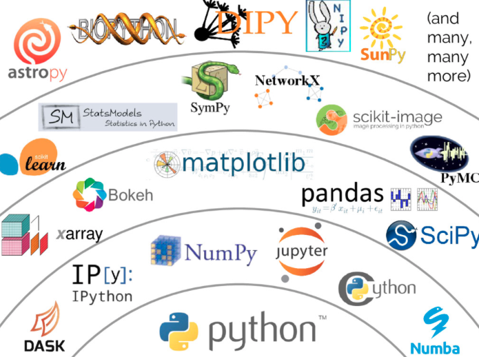

# Lesson 5: The Python scientific stack and data visualization

The Python scientific stack (aka python scientific ecosystem) is a set of libraries, modules and toolboxes widely used 
in scientific applications. All these tools build on Python and some of them also wrap code from compiled languages such as C and 
Fortran. The core ... modules are

1. 
2. 
3. 
4. 
