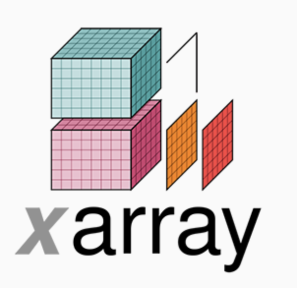

# Lesson 7: Introduction to xarray
Today we will learn about xarray: a python library for dealing with multidimensional label arrays. You can think of array as pandas for N-dimensions. In the words of Ryan Abernathey, xarray is pandas meets netCDF. To learn about xarray, let's fire up a blank jupyter notebook.

